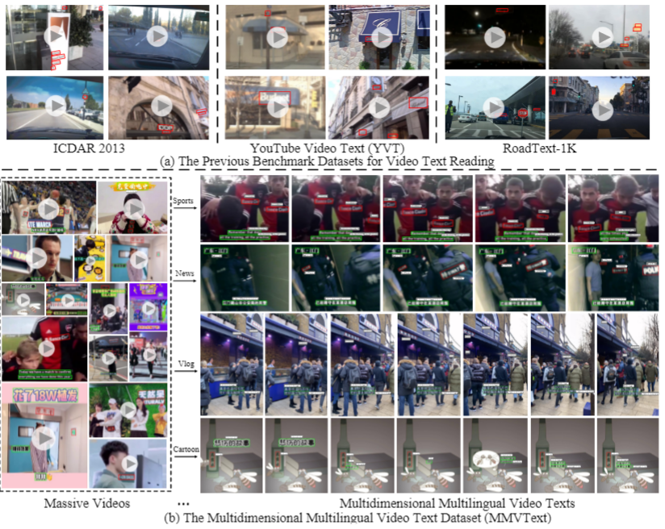

<div align="center">
  
</div>

# MMVText-Benchmark

MMVText: A Large-Scale, Multidimensional Multilingual Dataset for Video Text Spotting


Updated on June 06, 2021 (Added evaluation metric)

Released on May 26, 2021

# Description
We create a new large-scale benchmark dataset named **M**ultidimensional **M**ultilingual **V**ideo Text(MMVText), the first large-scale and multilingual benchmark for video text spotting in a variety of scenarios.

There are mainly three features for MMVText:
-  **Large-Scale**: we provide 510 videos with more than 1,000,000 frame images, four times larger than the existing largest dataset for text in videos. 
-  **Multidimensional**:MMVText covers 30 open categories with a wide selection of various scenarios, e.g., life vlog, sports news, automatic drive, cartoon, etc. Besides, caption text and scene text are separately tagged for the two different representational meanings in the video. The former represents more theme information, and the latter is the scene information. 
-  **Multilingual**:MMVText provides multilingual text annotation to promote multiple cultures live and communication.


# News

## Tasks and Metrics
The proposed MMVText support four task(text detection, recognition, tracking, spotting), but mainly includes two tasks: 
-  Video Text Tracking. 
-  End to End Text Spotting in Videos. 

MOTP (Multiple Object Tracking Precision)[1], MOTA (Multiple Object Tracking Accuracy) and IDF1[3,4] as the three important metrics are used to evaluate task1 (text tracking) for MMVText.
In particular, we make use of the publicly available py-motmetrics library (https://github.com/cheind/py-motmetrics) for the establishment of the evaluation metric. 


## Ground Truth (GT) Format

We create a single JSON file for each video in the dataset to store the ground truth in a structured format, following the naming convention:
gt_[frame_id], where frame_id refers to the index of the video frame in the video

In a JSON file, each gt_[frame_id] corresponds to a list, where each line in the list correspond to one word in the image and gives its bounding box coordinates, transcription, text type(caption or scene text) and tracking ID, in the following format:

>{
>
>“frame_1”:  
>			 [[x1, y1, x2, y2, x3, y3, x4, y4, “transcription1” , “text type”, “Tracking ID”],
>
>               …
>
>             [x1, y1, x2, y2, x3, y3, x4, y4, “transcription2” , “text type”, “Tracking ID”]],
>
>“frame_2”:  
>			 [[x1, y1, x2, y2, x3, y3, x4, y4, “transcription3” , “text type”,  “Tracking ID”],
>
>                …
>
>             [x1, y1, x2, y2, x3, y3, x4, y4, “transcription4” , “text type”, “Tracking ID”]],
>
>……
>
>}

## Table Ranking


## Citation


## Feedback
Suggestions and opinions of this dataset (both positive and negative) are greatly welcome. Please contact the authors by sending email to
`weijiawu@zju.edu.cn`.

## License and Copyright
The project is open source under BSD-3 license (see the ``` LICENSE ``` file).

Only for research purpose usage, it is not allowed for commercial purpose usage.

## References

[1] Dendorfer, P., Rezatofighi, H., Milan, A., Shi, J., Cremers, D., Reid, I., Roth, S., Schindler, K., & Leal-Taixe, L. (2019). CVPR19 Tracking and Detection Challenge: How crowded can it get?. arXiv preprint arXiv:1906.04567.

[2] Bernardin, K. &amp; Stiefelhagen, R. Evaluating Multiple Object Tracking Performance: The CLEAR MOT Metrics. Image and Video Processing, 2008(1):1-10, 2008.

[3] Ristani, E., Solera, F., Zou, R., Cucchiara, R. & Tomasi, C. Performance Measures and a Data Set for Multi-Target, Multi-Camera Tracking. In ECCV workshop on Benchmarking Multi-Target Tracking, 2016.

[4] Li, Y., Huang, C. &amp; Nevatia, R. Learning to associate: HybridBoosted multi-target tracker for crowded scene. In Proceedings of the IEEE Computer Society Conference on Computer Vision and Pattern Recognition, 2009.


